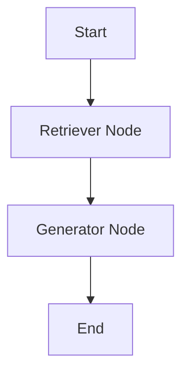
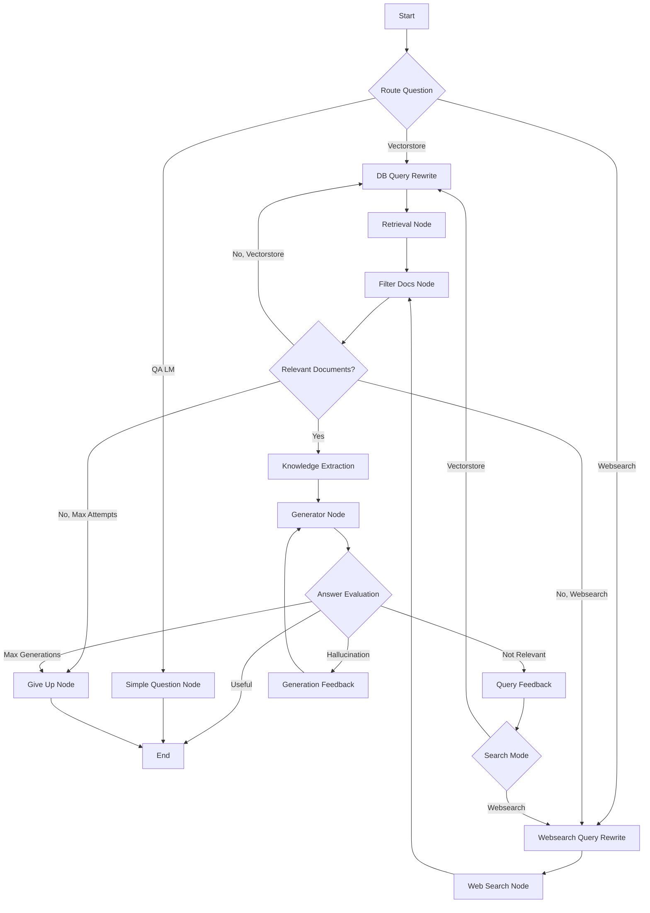

# AIIP-RAG-AGENT

## Overview

### Project Description
AIIP-RAG-AGENT is an advanced document processing and question-answering system that implements Retrieval-Augmented Generation (RAG) using LangGraph and ChromaDB. The project features two distinct RAG agents designed to handle different levels of query complexity and accuracy requirements. The system integrates with Google Drive for document ingestion and includes web search capabilities to supplement knowledge when needed.

### Key Features

#### General
This project is designed to be completely modular. Every aspect of the system is completely interchangeable, the vector database, the indexing pipeline, the chunking mechanisms, preprocessing steps, the agents. All in order to be able to experiment quickly with any progress or new technology in the field.

#### Document Processing & Management
- **Multi-source Document Ingestion**
  - Direct PDF upload support
  - Google Drive integration for remote document access
  - Automated document chunking (10k character default)
  - Metadata preservation and tracking

#### Vector Storage & Retrieval
- **ChromaDB Integration**
  - Efficient vector storage and retrieval
  - Collection-based document organization
  - Similarity search capabilities
  - OpenAI embeddings integration

#### Dual RAG Architecture
1. **Simple RAG Agent**
   - Straightforward retrieval-generation pipeline
   - Optimized for quick, direct questions
   - Minimal overhead for basic queries

2. **Complex RAG Agent**
   - Advanced query routing system
   - Hallucination detection and prevention
   - Multiple feedback loops for answer refinement
   - Fallback to web search when needed
   - Knowledge extraction and validation

### Current Status

#### Production Ready
- Core RAG pipeline implementation
- Document processing and indexing
- Google Drive integration
- Basic web UI and REST API endpoints

#### Under Development
- Advanced UI features
- Streaming responses
- Enhanced document exploration
- Web search integration improvements

#### Planned Enhancements
- Ollama Integration
- User authentication (Supabase)
- Expand to other vector databases and similarity search algorithms
- Docker containerization
- Azure OCR integration
- Conversation memory
- Dynamic topic extraction, to capture the topic of the contents that are being added to the collection, and dinamically add it to the searching and feedback prompts. 
- Add web scrapper loader. Structured output for specific information retrieval out of the whole scrape.
- Try NVIDIA Nim RAG Agent https://www.nvidia.com/en-us/ai-data-science/ai-workflows/?ncid=ref-inpa-832194
- Contextual indexing by Anthropic https://www.anthropic.com/news/contextual-retrieval
- Add Verbosity to the agents

## Technical Architecture

### RAG Agents Implementation

#### Simple RAG Agent

A straightforward pipeline optimized for direct queries that don't require extensive validation or multiple retrieval attempts.



**Flow Explanation:**

1. **Retriever Node**
  - Takes user query as input
  - Performs similarity search in ChromaDB
  - Returns top-k most relevant documents (default k=4)
  - Document content extracted for next stage

2. **Generator Node**
  - Combines retrieved documents with user query
  - Uses OpenAI's model for response generation
  - Returns concise, three-sentence maximum response
  - Focuses on direct answer extraction

#### Complex RAG Agent

Advanced pipeline with multiple validation steps, feedback loops, and fallback mechanisms.



**Flow Explanation:**

1. **Question Routing**
  - Analyzes query type and content
  - Routes to appropriate processing path:
    - Vectorstore: For document-specific queries
    - Websearch: For current events/external information
    - QA LM: For simple, general knowledge questions

2. **Query Processing**
  - DB Query Rewrite: Optimizes for vectorstore retrieval
  - Websearch Query Rewrite: Optimizes for web search
  - Incorporates feedback from failed attempts
  - Maintains retrieval attempt counting

3. **Document Processing**
  - Filters retrieved documents for relevance
  - Extracts knowledge based on query context
  - Routes to appropriate next step based on results
  - Maximum retrieval attempts enforced

4. **Answer Generation and Validation**
  - Generates candidate answers
  - Validates against source documents
  - Checks for hallucinations
  - Evaluates relevance to original question
  - Provides improvement feedback

5. **Feedback Mechanisms**
  - Query feedback for retrieval optimization
  - Generation feedback for answer improvement
  - Mode switching between vector and web search
  - Graceful fallback to simpler processing

## Getting Started

### Prerequisites

#### 1. Python Environment Setup
- Python 3.8 or higher required
- Choice of virtual environment:
```bash
# Using venv
python -m venv env
source env/bin/activate  # Linux/Mac
.\env\Scripts\activate   # Windows

# Using conda
conda create -n rag-env python=3.8
conda activate rag-env
```

#### 2. Google Cloud Project Setup
1. **Create and Configure Project:**
  - Visit [Google Cloud Console](https://console.cloud.google.com/)
  - Create new project or select existing one
  - Navigate to **API & Services > Library**, and enable the Google Drive API.

2. **Configure OAuth Consent:**
  - Navigate to "API & Services > OAuth consent screen"
  - Set up consent screen:
    - Choose "External" user type
    - Fill in application name and contact info
    - Add scope: `https://www.googleapis.com/auth/drive.readonly`

3. **Create Credentials:**
  - Go to "API & Services > Credentials"
  - Create OAuth 2.0 Client ID:
    - Select "Web application" type
    - Add authorized redirect URI: `http://localhost:8000/gdrive/oauth2callback`
  - Download JSON credentials file
  - Rename to `credentials.json` and place in `app/configs/`

#### 3. Required API Keys
Create `.env` file with the following API keys:
```bash
# OpenAI API Key for embeddings and LLM
OPENAI_API_KEY=your_openai_api_key

# Tavily API Key for web search
TAVILY_API_KEY=your_tavily_api_key

# Development Settings
OAUTHLIB_INSECURE_TRANSPORT=1  # Only for development
```

### Installation

1. **Clone Repository:**
```bash
git clone <repository-url>
cd agent-rag
```

2. **Install Dependencies:**
```bash
pip install -r requirements.txt
```

3. **Verify Installation:**
```bash
python -c "import langchain, chromadb, fastapi, streamlit"
```

### Running the Application

1. **Start Backend Server:**
```bash
# From project root
uvicorn app.api.app:app --reload --port 8000
```

2. **Start Frontend Interface:**
```bash
# In a new terminal
streamlit run ui/streamlit/Home.py
```

3. **Verify Setup:**
  - Backend API: Visit `http://localhost:8000`
  - Frontend UI: Visit `http://localhost:8501`

## Usage Guide

### Document Operations

#### Collection Management

1. **Create Collection**
  - Navigate to "Database Operations"
  - Enter unique collection name
  - Initialize collection
  - System creates ChromaDB collection

#### Document Upload and Processing

1. **Direct Upload**
  - Navigate to "Index Operations" in Streamlit UI
  - Use file uploader to select PDF files
  - Files are automatically saved to `data/raw_data`
  - Supported format: PDF files

2. **Google Drive Integration**
  - Click "Connect to Google Drive"
  - Complete OAuth authentication
  - Enter folder ID to download documents
  - Supported formats:
    - PDF files
    - Google Docs (auto-converted to PDF)
    - Google Sheets (auto-converted to PDF)
    - Google Slides (auto-converted to PDF)

3. **Process Documents**
  - Select target collection
  - Choose documents to process
  - System automatically:
    - Chunks documents (10k characters)
    - Generates embeddings
    - Stores in ChromaDB
    - Preserves metadata

4. **View and Search**
  - Browse documents in collection
  - Search by content
  - View document metadata
  - Adjust search parameters (k)

### RAG Agent Interaction

#### Query Types

1. **Simple Queries (Simple RAG)**
  - Best for: Direct, factual questions
  - Examples:
    - "What is the main topic of document X?"
    - "When was the project started?"
  - Features:
    - Quick response time
    - Direct answer format
    - Source document reference

2. **Complex Queries (Complex RAG)**
  - Best for: Analysis, multi-context questions
  - Examples:
    - "Compare the approaches discussed in document X"
    - "What are the implications of the findings?"
  - Features:
    - Multi-source validation
    - Web search augmentation
    - Hallucination prevention

#### Best Practices

1. **Query Formulation**
  - Be specific in questions
  - Provide context when needed
  - Specify document scope if known
  - Use clear, unambiguous language

2. **Collection Organization**
  - Group related documents
  - Use meaningful collection names
  - Regular collection cleanup
  - Monitor collection size

