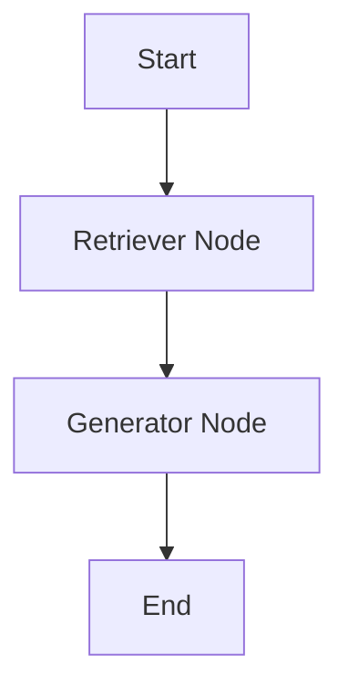
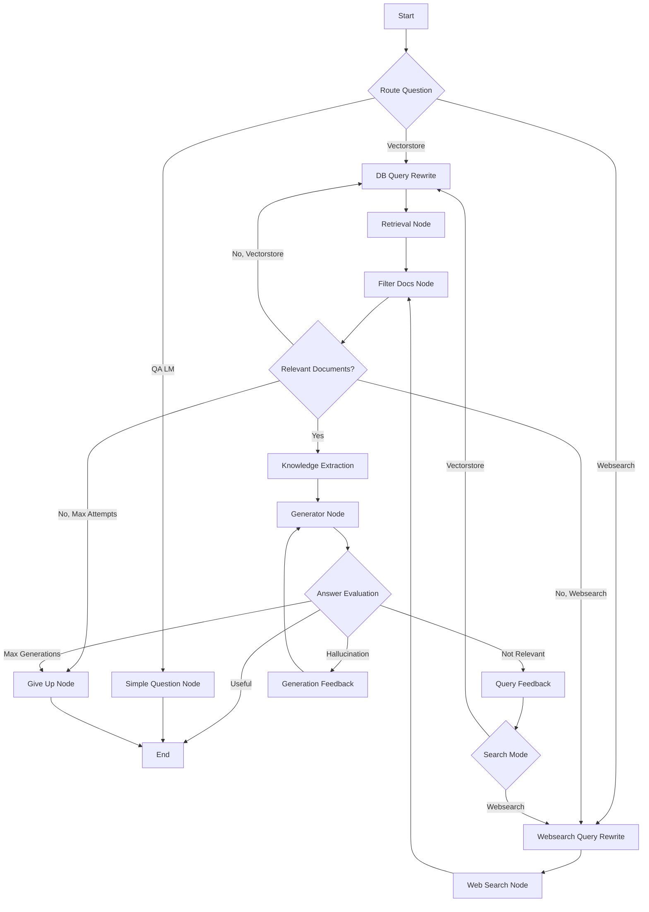

# RAG Agents Comparison

## Simple RAG Agent

Here's a breakdown of Simple RAG Agent flow:

1. The process starts with the retrieval node.
2. The retrieved documents are passed to the generation node.

---

## Complex RAG Agent

Here's a breakdown of Complex RAG Agent flow:

1. The process starts with routing the question.
2. Based on the routing, it goes to either:
   - DB Query Rewrite
   - Websearch Query Rewrite
   - Simple Question Node
3. The DB Query Rewrite and Websearch Query Rewrite lead to their respective retrieval nodes.
4. Retrieved documents are filtered.
5. If relevant documents are found:
   - They go through Knowledge Extraction
   - Then to the Generator Node
6. The generated answer is evaluated.
7. Based on the evaluation, it either:
   - Ends the process
   - Gives feedback and tries again
   - Gives up if max attempts are reached
8. The Simple Question Node leads directly to the end.

